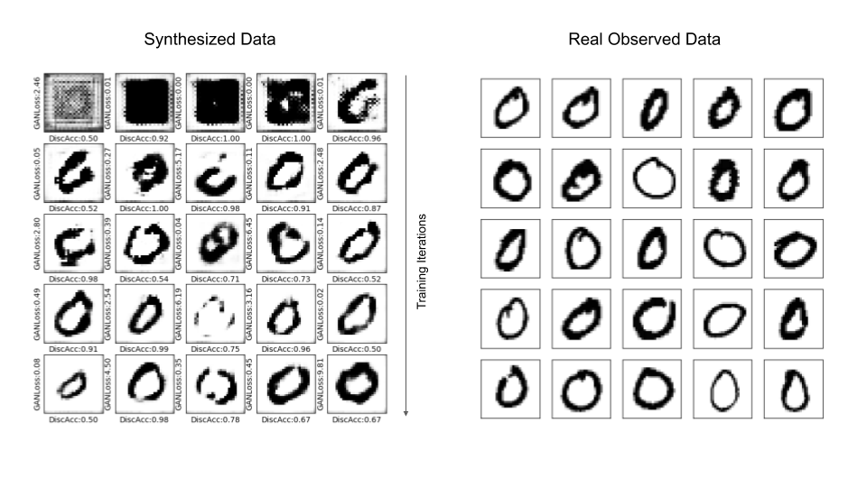
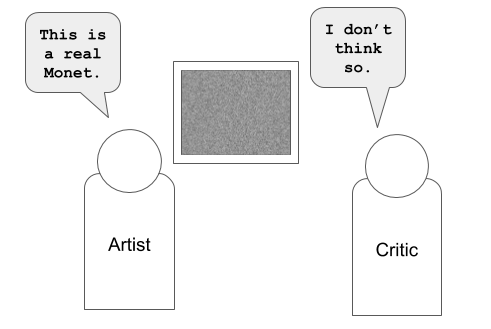

# Deep-Fake-Experiments
With the rise of Deep Fakes, learnt to implement Deep Convolutional Generative Adversarial Network and trained the model to generate realistic looking synthesized images

 

